# Diagramme de Classes — MLBlock

```mermaid
classDiagram
    %% ============================
    %% Modèles Pydantic — models/
    %% ============================

    class ParamSpec {
        +str type
        +bool required
        +Any default
        +str description
    }

    class PortSpec {
        +str name
        +str dtype
    }

    class BlockSpec {
        +str label
        +str category
        +dict~str, ParamSpec~ params
        +list~PortSpec~ inputs
        +list~PortSpec~ outputs
        +str template
        +bool children_allowed
        +str~None~ generates_class
        +str~None~ class_base
    }

    class PipelineNode {
        +str id
        +str type
        +dict~str, Any~ params
        +list~PipelineNode~ children
    }

    class PipelineEdge {
        +str source
        +str source_port
        +str target
        +str target_port
    }

    class PipelineDef {
        +list~PipelineNode~ nodes
        +list~PipelineEdge~ edges
        +validate_types_in_registry() Self
        +validate_edges() Self
        +validate_dtype_compatibility() Self
        -_all_nodes() list
    }

    %% ============================
    %% Core — core/
    %% ============================

    class PipelineValidator {
        +validate(raw: dict, registry: BlockRegistry) PipelineDef
    }

    class DAGResolver {
        +resolve(pipeline: PipelineDef) list~PipelineNode~
        -_resolve_nested(parent, pipeline, node_map)
    }

    class CodeGenerator {
        -registry: BlockRegistry
        +generate(nodes, edges) str
        -_generate_class(node, spec) str
        -_resolve_inputs(code, node, inbound) str
        -_resolve_outputs(code, node) str
        -_resolve_params(code, node, spec) str
        -_resolve_node_id(code, node) str
        -_resolve_special_placeholders(code, node, spec) str
        -_resolve_cond_params(code, node) str
        -_escape_braces(code) str
        -_unescape_braces(code) str
        -_metric_expr(method, node) str
        -_plot_code(node, spec) str
        -_space_expr(node) str
        -_resolve_var(node_id, port_name) str
        -_serialize_param(value, type) str
        -_serialize_param_raw(value, type) str
        -_extract_imports(code, imports) str
        -_wrap_try_except(node, code) str
        -_assemble(imports, class_defs, body) str
    }

    class PipelineExecutor {
        +run(main_py_path: str, timeout: int) CompletedProcess
    }

    %% ============================
    %% Registry — blocks/
    %% ============================

    class BlockRegistry {
        +dict~str, BlockSpec~ registry
    }

    class AutoDiscover {
        +dict~str, BlockSpec~ BLOCK_REGISTRY
        +dict~str, Path~ _KEY_SOURCE
        -_discover()
    }

    %% ============================
    %% Blocs concrets (représentants)
    %% ============================

    class LoadCSV {
        +label = "Charger un CSV"
        +category = "data"
        +params: path
        +inputs: ~
        +outputs: dataset (DataFrame)
    }

    class TrainTestSplit {
        +label = "Séparer train/test"
        +category = "data"
        +params: ratio, shuffle, seed
        +inputs: dataset (DataFrame)
        +outputs: train (DataFrame), test (DataFrame)
    }

    class LinearRegression {
        +label = "Régression linéaire"
        +category = "models"
        +params: target_column, fit_intercept
        +inputs: train_data (DataFrame)
        +outputs: model (Model)
    }

    class Evaluate {
        +label = "Évaluer le modèle"
        +category = "evaluation"
        +params: target_column, method, plot
        +inputs: model (Model), test_data (DataFrame)
        +outputs: score (float)
    }

    class GymEnv {
        +label = "Créer un environnement Gymnasium"
        +category = "environment"
        +params: env_id, n_envs, seed
        +inputs: ~
        +outputs: env (Environment)
    }

    class TrainRL {
        +label = "Entraîner un agent RL"
        +category = "rl"
        +params: algorithm, total_timesteps, lr, gamma, policy, seed
        +inputs: env (Environment)
        +outputs: model (RLModel)
    }

    class EvaluateRL {
        +label = "Évaluer un agent RL"
        +category = "rl"
        +params: n_episodes, render, plot_rewards
        +inputs: model (RLModel), env (Environment)
        +outputs: mean_reward (float)
    }

    class CustomEnv {
        +label = "Environnement personnalisé"
        +category = "environment"
        +params: env_name, render_mode
        +inputs: ~
        +outputs: env (Environment)
        +children_allowed = true
        +generates_class = "CustomEnv"
        +class_base = "gym.Env"
    }

    class CodeBlock {
        +label = "Code personnalisé"
        +category = "advanced"
        +params: code, exec_location
        +inputs: any
        +outputs: any
    }

    class NormalizeObs {
        +label = "Normaliser l'environnement"
        +category = "environment"
        +inputs: env (Environment)
        +outputs: env (Environment)
    }

    class FrameStack {
        +label = "Empiler les frames"
        +category = "environment"
        +params: n_stack
        +inputs: env (Environment)
        +outputs: env (Environment)
    }

    class RecordVideo {
        +label = "Enregistrer une vidéo"
        +category = "visualization"
        +params: video_folder, episode_trigger
        +inputs: env (Environment)
        +outputs: env (Environment)
    }

    %% ============================
    %% Relations
    %% ============================

    %% Composition — PipelineDef contient PipelineNode et PipelineEdge
    PipelineDef *-- PipelineNode : contient
    PipelineDef *-- PipelineEdge : contient
    PipelineNode *-- PipelineNode : enfants recursifs

    %% Association — BlockSpec est composé de specs
    BlockSpec *-- ParamSpec : params
    BlockSpec *-- PortSpec : inputs
    BlockSpec *-- PortSpec : outputs

    %% Dépendances — Core utilise les modèles
    PipelineValidator ..> PipelineDef : valide
    PipelineValidator ..> BlockRegistry : utilise
    DAGResolver ..> PipelineDef : ordonne
    CodeGenerator ..> BlockRegistry : utilise
    CodeGenerator ..> PipelineNode : génère le code
    CodeGenerator ..> PipelineEdge : résout les connexions

    %% Héritage — Blocs concrets sont des BlockSpec
    LoadCSV --|> BlockSpec : instance de
    TrainTestSplit --|> BlockSpec : instance de
    LinearRegression --|> BlockSpec : instance de
    Evaluate --|> BlockSpec : instance de
    GymEnv --|> BlockSpec : instance de
    TrainRL --|> BlockSpec : instance de
    EvaluateRL --|> BlockSpec : instance de
    CustomEnv --|> BlockSpec : instance de
    CodeBlock --|> BlockSpec : instance de
    NormalizeObs --|> BlockSpec : instance de
    FrameStack --|> BlockSpec : instance de
    RecordVideo --|> BlockSpec : instance de

    %% Registry
    AutoDiscover ..> BlockRegistry : alimente
    BlockRegistry --* BlockSpec : indexe

    %% Exécution
    PipelineExecutor ..> PipelineDef : exécute main.py generé
```

## Légende

| Symbole UML | Signification |
|---|---|
| `+` | Public |
| `-` | Private |
| `#` | Protected |
| `*--` | Composition (losange plein) — contient, cycle de vie lié |
| `..>` | Dépendance (traitillé, ouverte) — utilisation temporaire |
| `--\|>` | Héritage (triangle creux) — "est un" |
| `--*` | Agrégation (losange vide) — contient, cycle de vie indépendant |

## Notes

- **BlockSpec** est la classe centrale : elle décrit un bloc de manière déclarative via Pydantic.
- Chaque bloc concret (LoadCSV, GymEnv, ...) est une **instance unique** de BlockSpec, pas une sous-classe. La flèche d'héritage `--|>` représente l'instanciation au sens "est configuré par".
- **PipelineNode** est récursif : un nœud peut contenir des enfants (sous-pipeline ou code_block).
- **CodeGenerator** est la classe la plus complexe : elle résout les placeholders, gère la génération de classes, déduplique les imports, et assemble le fichier final.
- **AutoDiscover** est un module fonctionnel (pas une classe instanciée) qui peuple BLOCK_REGISTRY au chargement.
