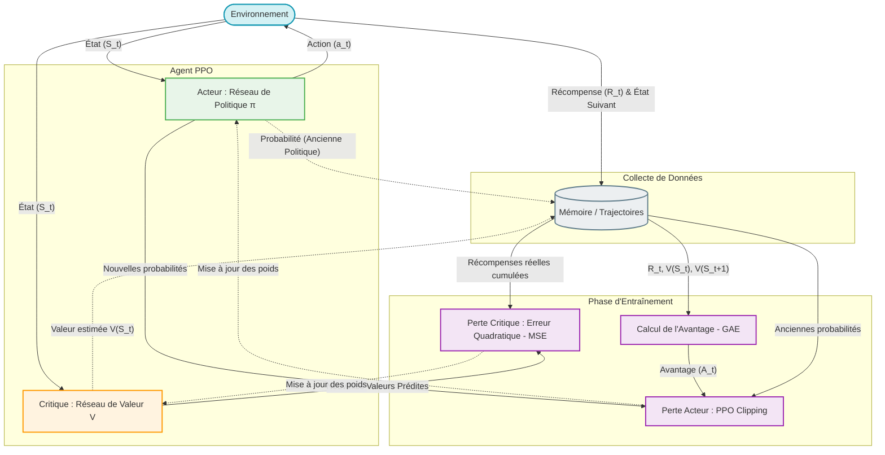

Edited Definition.md
Viewed Definition.md:1-23

Voici un schéma détaillé de l'architecture et du cycle d'entraînement du PPO. Tu peux copier-coller ce bloc de code directement dans Obsidian, il sera généré visuellement grâce à Mermaid !

### Comment lire ce schéma :
1. **La boucle du haut (Collecte)** : L'Acteur et le Critique regardent l'Environnement. L'Acteur prend des actions, l'Environnement renvoie des récompenses. Tout est sauvegardé dans le **Buffer** (la mémoire).
2. **Le point central (GAE)** : Une fois qu'on a joué quelques parties, on utilise la mémoire pour calculer l'**Avantage** (est-ce que l'action prise était meilleure que ce qu'avait prédit le Critique ?).
3. **La boucle du bas (Entraînement)** : 
   * On met à jour l'**Acteur** en comparant ses *nouvelles* probabilités avec les *anciennes* stockées en mémoire (c'est ici qu'intervient le fameux **Clipping** pour ne pas faire de mise à jour trop brutale).
   * On met à jour le **Critique** pour qu'il devienne plus précis dans ses futures estimations. 

#ReinforcementLearning/ActorCritic #PPO #Architecture
