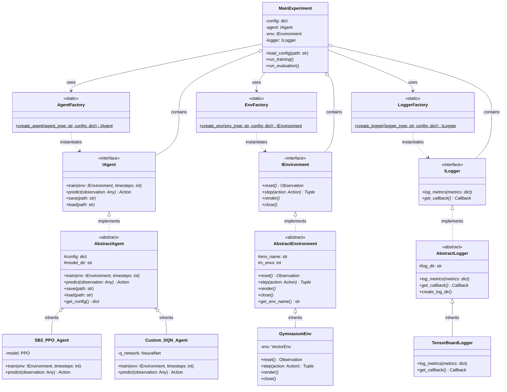

# Architecture Orientée Objet Modulaire pour le RL

Ce document présente l'architecture hautement modulaire basée sur le pattern Factory et l'injection de dépendances, conçue pour le projet PoC MLblock. Elle met en place une séparation stricte entre **Interfaces** (Contrats purs), **Classes Abstraites** (Logique partagée) et **Implémentations concrètes**.

## Diagramme de Classe

## Explication des blocs

1.  **Les Interfaces (`IAgent`, `IEnvironment`, `ILogger`)** : Ce sont des contrats stricts (100% abstraits). Elles définissent le "*Quoi*" sans s'occuper du "*Comment*". N'importe quelle méthode qui attend un environnement s'attendra à manipuler un type `IEnvironment`.
2.  **Les Classes Abstraites (`AbstractAgent`, `AbstractEnvironment`...)** : Elles implémentent l'Interface pour y ajouter de la **logique partagée**. Par exemple, `AbstractAgent` gère le dictionnaire de configuration (`#config`) et fournit éventuellement une implémentation par défaut de la fonction `save()` ou `load()`. Les méthodes `train()` restent abstraites et doivent être gérées par les enfants.
3.  **Les Implémentations (`SB3_PPO_Agent`, `GymnasiumEnv`...)** : Elles héritent des Classes Abstraites. Elles contiennent le vrai code technique lié aux bibliothèques (SB3, Gym) et remplissent les méthodes manquantes.
4.  **Les Factories (`AgentFactory`...)** : Elles lisent une configuration et instancient la bonne classe dynamiquement. Fait important : elles retournent un type d'Interface (`IAgent`) à l'appelant.
5.  **L'application centrale (`MainExperiment`)** : Elle est couplée **uniquement aux Interfaces**. Elle se contente d'appeler `agent.train(env)` sans savoir s'il s'agit d'un réseau de neurones PPO dans un environnement Gymnasium, ou d'une Table Q dans un environnement Custom.

#ReinforcementLearning/Architecture #OOP #DesignPattern #Factory
