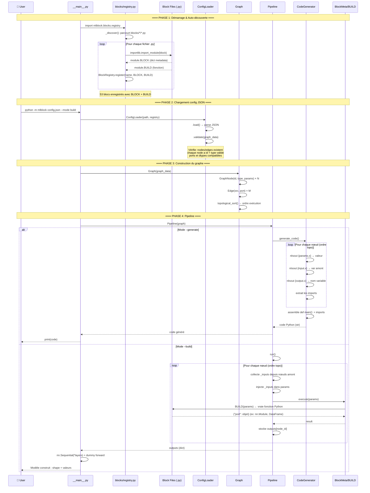

# Diagrammes MLBlock

## 1. Diagramme de Séquence — Exécution complète



## 2. Diagramme de Séquence — Focus Build (détail d'un bloc)

```mermaid
sequenceDiagram
    participant PL as Pipeline.run()
    participant N as GraphNode
    participant BM as BlockMeta
    participant B as BUILD(params)

    Note over PL,B: Exemple: linear_regression bloc

    PL->>N: récupère le nœud (ordre topo)
    PL->>PL: collecte _inputs depuis amont
    Note over PL: _inputs = {"train_data": DataFrame}

    PL->>N: node.params["_inputs"] = inputs
    PL->>BM: execute(params)

    BM->>BM: params.pop("_inputs") → inputs

    rect rgb(240, 255, 240)
        Note over BM,B: Appel à la vraie fonction Python
        BM->>B: BUILD(params)
        B->>B: data = params["_inputs"]["train_data"]
        B->>B: X = data.drop(target); y = data[target]
        B->>B: model = LinearRegression().fit(X, y)
        B-->>BM: {"model": <trained_model>}
    end

    BM->>BM: si dict → return direct<br/>sinon → wrap dans {first_output: value}
    BM-->>PL: {"model": <sklearn_model>}

    PL->>PL: stocke outputs["regression"] = result
    Note over PL: ↓ bloc suivant reçoit:<br/>_inputs = {"model": <trained_model>}
```

## 3. Diagramme de Flux — Auto-découverte

```mermaid
flowchart TD
    A[python -m mlblock] --> B[import mlblock.blocks.registry]
    B --> C[_discover()]
    C --> D{parcourt blocks/*/*.py}
    D --> E[neural/linear.py]
    D --> F[neural/conv2d.py]
    D --> G[neural/...]
    D --> H[data/load_csv.py]
    D --> I[rl/train_rl.py]
    D --> J[models/random_forest.py]

    E --> K{has BLOCK ?}
    K -->|oui| L{has BUILD ?}
    L -->|oui| M[register(name, BLOCK, BUILD)]
    L -->|non| N[register(name, BLOCK, None)]

    M --> O[BlockRegistry._blocks]
    N --> O

    O --> P[53 blocs indexés]
    P --> Q[ConfigLoader.validate]
    Q --> R[Graph.build]
    R --> S[Pipeline]
    S --> T{--mode ?}
    T -->|generate| U[CodeGenerator]
    T -->|build| V[Pipeline.run → BUILD]
```
