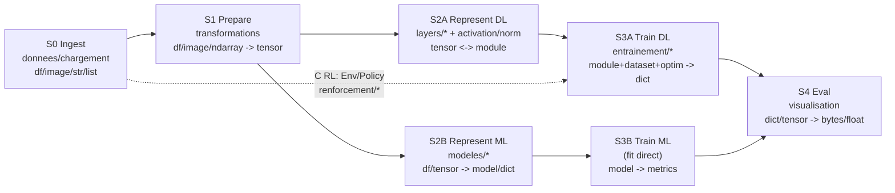

# 04 — Familles selon la pipeline IA

> **But:** Passer de 16 `family` orthogonales à **5 groupes UX constants** alignés sur les étapes IA, sans perdre la sécurité `incompatible`.

## Rappel: 16 families aujourd'hui (`core/types.py:12-50`)

`df, model, image, dict, ndarray, scalar, str, list, env, policy, tensor, dataset, optim, module, tuple, any` + fallbacks `bytes/None`. Graphe réel = 3 arêtes seulement (`df/image/ndarray -> tensor` via `transformations`).

Problème: `family` est technique (`torch.utils.data.* -> dataset`), pas pédagogique. L'apprenant voit 16 couleurs, pas 5 étapes.

## Cible: 5 Stages (méta-pattern constant + 3 variantes)

Squelette constant `CRISP-DM`: `Ingest -> Prepare -> Represent -> Train -> Eval`. Variantes sur `Represent/Train`:



| Stage | Groupes UX (1 couleur) | Families internes | Categories | Pattern IA |
|---|---|---|---|---|
| **S0 Ingest** | Données | `df, image, ndarray, str, list` | `donnees-22C55E`, `chargement-7C3AED` | A/B/C |
| **S1 Prepare** | Préparation | `df/image/ndarray -> tensor` (les 3 arêtes) | `transformations-F5A623`, `texte-9AA0C4` | A/B |
| **S2A DL** | Modèle DL | `tensor, module` | `layers-6366F1` (ex-conv), `activation-*`, `normalisation-*`, `regroupement-*`, `sequences-*` | A |
| **S2B ML** | Modèle ML | `df/tensor -> model/dict` | `modeles-F59E0B` | B |
| **S3A Train DL** | Entraînement | `module+dataset+optim+loss -> dict` | `entrainement-DE497D` | A |
| **S3B** | (fit ML, pas de block train) | `model` | `modeles` | B |
| **S4 Eval** | Évaluation | `dict/tensor/model -> bytes/float` | `visualisation-*` | A/B |
| **SX RL** | Monde | `env, policy` (isolés) | `renforcement-E8C77A` | C |

> **Précision S2A (CNN vs Seq) :** Avec A6 (NLP LSTM) et A7 (Séries temporelles), `S2A` englobe deux sous-états conceptuels (`S2A-CNN` avec convolutions/pooling et `S2A-Seq` avec tokenize/vocab/embedding/LSTM/GRU). Ils partagent le même Stage `S2A` sans prolifération de stages.

**Règle:** `Category` (dossier + couleur) sert S0..S4 (palette filtrée), `Family` sert `classify` (validation). `Bridge` implicite: 1 `Stage` = N `Family`.

## Implémentation

1. **Nouveau `Stage` enum** (`core/stages.py` + `frontend/src/utils/stages.ts`):

```py
class Stage(Enum):
    INGEST=0; PREPARE=1; REPRESENT_DL=2; REPRESENT_ML=2; TRAIN_DL=3; EVAL=4; WORLD=9
STAGE_OF_FAMILY = {"df":0, "image":0, "tensor":1, "module":2, "model":2, "dataset":3, ...}
STAGE_OF_CATEGORY = {"donnees":0, "transformations":1, "layers":2, "entrainement":3, ...}
```

2. **Catalog:** `GET /api/catalog` renvoie `stages[]` en plus de `categories[]` — `FlowCanvas` filtre palette par `stage` courant (pas par `family`).
3. **Validation:** `validation.py:validate` ajoute `stage(dst) < stage(src) -> "Stage mismatch: S2 before S1"` (sauf loop `S3->S1` autorisée).
4. **Sync front/back:** corrige `familyOf` manques (`image/list/env/policy` + `_split_union`) — sinon `S1` faux sur `PIL | ndarray`.
5. **Badges de Stage visuels sur le canvas (Astryx) :** chaque `BlockNode.tsx` affiche un badge visuel du stage (`S0`..`S4`, `SX`) avec la couleur associée au Stage pour guider visuellement l'apprenant dans le respect du pipeline IA.

## Critères d'acceptation

* [ ] `docs/adr/0001-staged-pipeline.md` (pourquoi 5 stages, pas 16 families)
* [ ] `GET /api/catalog` expose `stages`, `FlowCanvas` filtre par stage (toggle palette)
* [ ] Palette par défaut ~45 blocks (§02) répartis 5 stages, pas 13 catégories à plat
* [ ] Badges de Stage affichés sur les `BlockNode` via Astryx
* [ ] `test_types.py` + `test_validation.py` couvrent `stage` mismatch

## Risques

* **RL (C) qui casse le linéaire:** `SX` isolé — `env` ne traverse jamais `S1/S2`. Ne pas forcer `Env -> tensor`.
* **Faire §04 sans §05 (typage):** `Stage` seul sans `Facade` = 2 sources de vérité. §04 et §05 sont le même chantier (mêmes fichiers `types.py/typeCheck.ts/portResolution.ts`).
