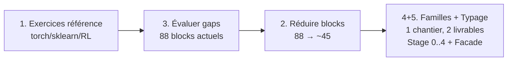

# UX Blocks Rework — Plan de refonte

> **Objectif:** Rendre le typing **facile** (moins de types visibles) **et sûr** (validation forte avant `generator.py`/`execution.py`). Pas 1 super-type `Any`, mais **1 Facade + 3 Templates par pattern IA**.

> **Décision 2026-09-11:** Ordre recommandé adopté — `1 → 3 → 2 → 4+5`. Voir [00-ordre-debat](./00-ordre-debat.md).

## Roadmap adoptée

*Pourquoi cet ordre?* `S1` fixe le besoin, `S3` mesure la couverture avec les 88 blocks existants (`S2` avant `S3` = coupe à l'aveugle), `S4+S5` touchent les mêmes 4 fichiers (`core/types.py`, `validation.py`, `typeCheck.ts`, `portResolution.ts`) → 1 PR en 2 commits.

## Livrables par étape

| Étape | Dossier | Entrée | Sortie | Gate |
|---|---|---|---|---|
| **1** | [01-exercices-reference](./01-exercices-reference.md) | `pytorch.org/tutorials`, `scikit-learn.org/stable`, `gymnasium.farama.org`, `configs/`, `tests/` | 12 exercices canoniques + DAGs de référence + datasets + sources | Liste figée validée, chaque exo a `inputs→outputs` typés + lien doc officielle |
| **3** | [03-evaluation-gaps](./03-evaluation-gaps.md) | Exos §1 × 88 blocks | Tableau coverage `exo × block_path` + 5-10 gaps P0/P1 + issues créées | Tous les exos P0 passent `validation.validate` en sec |
| **2** | [02-reduction-blocks](./02-reduction-blocks.md) | Inventaire 88 blocks + matrice §3 | Matrice `garder/fusionner/déprécier/supprimer` + cible ~45 blocks | Aucune suppression sans mapping vers exo §1 |
| **4+5** | [04-familles-pipeline](./04-familles-pipeline.md) + [05-typage](./05-typage.md) | Patterns IA `A/B/C` (Supervisé/Non-sup/RL) | `Stage 0..4` + `Family 16→5 groupes UX` + `TypeSystem Facade` + auto-insert `convertible` | Palette filtrée par stage, `family_of` sync front/back, `incompatible` avec suggestion |

## Dépendances

* `S1` est prérequis de tout — sans exos, tu optimises à l'aveugle.
* `S3 → S2` : `S3` a besoin de `S1` (exos fixent le besoin), `S2` a besoin de `S3` (matrice coverage dit quoi garder). `S2 → S3` n'existe pas — d'où `1→3→2`.
* `S4` et `S5` sont le même code (`core/types.py` + `typeCheck.ts` + `portResolution.ts` + `validation.py`). Les séparer = 2 PRs qui se conflictent sur les mêmes lignes → **1 PR, 2 commits** (`feat(stages)` puis `feat(type-system-facade)`).
* `S3 → S4` : le mapping `exo → stage` (ex: `kmeans` n'a pas de `optim`) définit les `Stage`.

## Comment lire ce dossier

1. [00-ordre-debat.md](./00-ordre-debat.md) — décision prise, 5 questions tranchées.
2. Puis chaque `0N-*.md` est **exécutable**: objectif, entrées/sorties, critères d'acceptation, risques, patterns `refactoring.guru`.

## Patterns transverses

* **Facade** — 1 `TypeSystem` pour `validation.py` + `generator.py` + `FlowCanvas`
* **Template Method** — squelette `Ingest→Prepare→Represent→Train→Eval`, 3 variantes `A/B/C`
* **State** — `Pipeline.stage` qui change `canConnect()`
* **Strategy** — conversions `df/image/ndarray → tensor` pluggables
* **Adapter** — pont migratoire `*_layer` vs `Tensor` legacy (issue #14)

Voir [../patterns-unification.md](../patterns-unification.md) pour la table complète.
