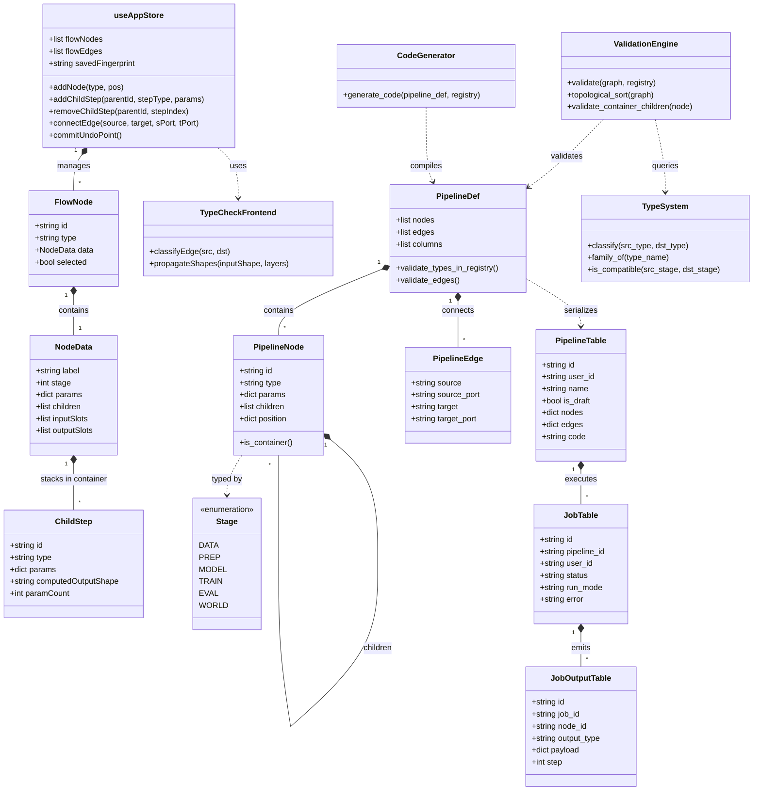

# Spécification d'Architecture & Modèle de Typage (ARCHITECTURE.md)

Ce document décrit l'architecture logicielle post-implémentation pour le support des **Super-Blocs Conteneurs** et le **typage à double niveau (Macro / Micro)** dans MLBlock.

---

## 1. Modèle de Données Hiérarchique

Le schéma de données existant dans `backend/mlblock/models/pipeline.py` dispose déjà de la propriété native `children: list[PipelineNode] = []`. L'implémentation des Super-Blocs s'appuie directement sur cette structure sans casser le schéma existant.

### A. Représentation d'un Nœud Conteneur

Un conteneur (`is_container = True` ou `type = "sequential_container"`) encapsule une liste ordonnée d'étapes enfants :

```json
{
  "id": "cnn_model_1",
  "type": "sequential_container",
  "params": {
    "name": "CNN Backbone",
    "stage": 2
  },
  "children": [
    {
      "id": "c1",
      "type": "conv2d_layer",
      "params": { "in_channels": 3, "out_channels": 32, "kernel_size": 3 }
    },
    {
      "id": "c2",
      "type": "relu_layer",
      "params": {}
    },
    {
      "id": "c3",
      "type": "maxpool2d_layer",
      "params": { "kernel_size": 2, "stride": 2 }
    },
    {
      "id": "c4",
      "type": "flatten_layer",
      "params": { "start_dim": 1 }
    },
    {
      "id": "c5",
      "type": "linear_layer",
      "params": { "in_features": 7200, "out_features": 10 }
    }
  ],
  "position": { "x": 520, "y": 140 }
}
```

---

## 2. Le Typage à Double Niveau

### A. Niveau Macro : Contrats de Ports & Validation Topologique
- **Contrôleur :** `backend/mlblock/validation.py` + `frontend/src/utils/typeCheck.ts`.
- **Règles :**
  - Validation du `Stage` canonique : les liaisons progressent dans l'ordre croissant $S_0 \to S_1 \to S_2 \to S_3 \to S_4$.
  - Les conteneurs exposent une interface globale :
    - `DataContainer` (S0/S1) $\to$ Sortie `DataLoader` / `Tensor`.
    - `ModelContainer` (S2) $\to$ Entrée `Tensor` et Sortie `torch.nn.Module`.
    - `TrainerContainer` (S3) $\to$ Entrées `model: nn.Module` et `loader: DataLoader`.
  - La classification des arêtes (`EXACT`, `FAMILY`, `CONVERTIBLE`, `INCOMPATIBLE`) est résolue par `TypeSystem.classify()`.

### B. Niveau Micro : Inférence Analytique des Formes (Shape Propagation)
- **Contrôleur :** Exécuté localement dans le navigateur (TypeScript) sans appel réseau.
- **Principe :** Propagation de forme géométrique à travers la pile séquentielle :
  - **Entrée :** Shape connue du dataset (ex: `CIFAR-10` $\to [B, 3, 32, 32]$).
  - **Conv2D($C_{in}, C_{out}, K, P, S$) :**
    $$H_{out} = \left\lfloor \frac{H_{in} - K + 2P}{S} \right\rfloor + 1, \quad W_{out} = \left\lfloor \frac{W_{in} - K + 2P}{S} \right\rfloor + 1$$
  - **MaxPool2D($K, S$) :** Division entière de la résolution spatiale.
  - **Flatten :** $D_{flat} = C_{out} \times H_{out} \times W_{out}$.
  - **Linear :** $in\_features$ est automatiquement renseigné avec $D_{flat}$.
- **Tolérance d'erreur :** Si l'utilisateur force une couche incompatible, l'interface affiche l'erreur en ligne immédiatement dans le tiroir du conteneur.

---

## 3. Diagramme de Classes (Mermaid)

Le diagramme ci-dessous reflète l'architecture logicielle post-implémentation, reliant le frontend React/Zustand, les modèles Pydantic, la validation backend, le générateur de code et les entités SQLModel de persistance Supabase.



---

## 4. Codegen Post-Implémentation (`generator.py`)

Quand un conteneur comme `CNN Backbone` est compilé, le générateur produit un bloc unifié propre sans nœuds virtuels intermédiaires :

```python
# Code généré automatiquement par MLBlock
import torch
import torch.nn as nn

class GeneratedCNN(nn.Module):
    def __init__(self):
        super().__init__()
        self.network = nn.Sequential(
            nn.Conv2d(in_channels=3, out_channels=32, kernel_size=3),
            nn.ReLU(),
            nn.MaxPool2d(kernel_size=2, stride=2),
            nn.Conv2d(in_channels=32, out_channels=64, kernel_size=3),
            nn.Flatten(start_dim=1),
            nn.Linear(in_features=7200, out_features=10)
        )

    def forward(self, x):
        return self.network(x)

model = GeneratedCNN()
```

L'entraînement reçoit ensuite directement `model` et `data_loader`, réduisant la complexité du script final et éliminant tout code mort.
