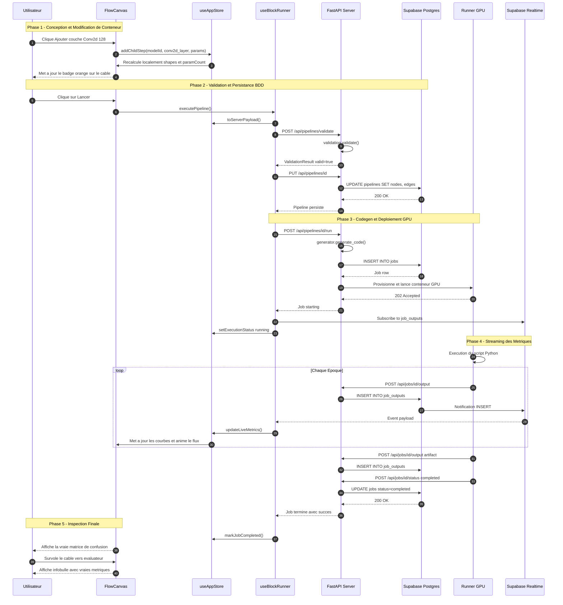

# Cycle de Vie Distant & Flux de Données (DATA_FLOW_SEQUENCE.md)

Ce document décrit le cycle d'exécution complet d'un pipeline MLBlock, en intégrant les contraintes de l'architecture distribuée : exécution distante (GPU Vast.ai), persistance Supabase (Postgres & Realtime) et affichage des métriques et du **Data Peeking** sur le canvas.

---

## 1. Modèle d'Exécution Distante (Remote Execution)

MLBlock n'exécute pas de calculs ML dans le navigateur de l'utilisateur ni sur le serveur web FastAPI. L'architecture sépare distinctement la conception et l'exécution :

```
[ Navigateur Client ]
       │  (1) Sauvegarde & Validation JSON
       ▼
[ FastAPI + Supabase DB ]
       │  (2) Codegen + Orchestration
       ▼
[ Instance GPU Distante (Vast.ai) ]
  - Exécute le script Python généré
  - Stream les statuts et sorties via callbacks HTTP (gpu_auth)
       │  (3) POST /api/jobs/{id}/output
       ▼
[ Supabase Postgres & Realtime ]
       │  (4) Notification push Realtime (fallback poll 2s/3s)
       ▼
[ Canvas Client : Flux Vivant & Data Peeking ]
```

---

## 2. Les Trois Modalités du « Data Peeking »

Pour permettre à l'utilisateur d'inspecter les données au survol d'un câble sans exiger une exécution GPU préalable :

| Modalité | Moment | Source de Données | Contenu Affiché |
|---|---|---|---|
| **1. Datasets Canoniques** | Dès la conception | Cache statique / Métadonnées catalogue | Shape du batch, miniatures 32x32 (CIFAR/MNIST), labels |
| **2. Fichiers Utilisateur (CSV/Images)** | À l'upload | Métadonnées de stockage Supabase | 5 premières lignes du CSV, types de colonnes, distribution |
| **3. Artefacts d'Exécution (Post-Run)** | En cours / Fin de Run | Table `job_outputs` (Supabase Realtime) | Vraies courbes de perte, précision, matrice de confusion PNG |

---

## 3. Diagramme de Séquence de Bout en Bout (Mermaid)

Le diagramme suivant détaille la séquence exacte depuis l'action de l'utilisateur sur le canvas jusqu'à l'illumination du flux vivant et des données réelles :



---

## 4. Gestion des Pannes et Fallback Réseau

- **Coupure WebSocket Realtime :** Si la connexion Supabase Realtime est instable, `useBlockRunner` bascule automatiquement sur un polling HTTP régulier (`GET /api/jobs/{id}/status` toutes les 3s et `GET /api/jobs/{id}/outputs` toutes les 2s).
- **Timeout GPU :** Si l'instance Vast.ai ne répond plus, le serveur FastAPI marque le job en `error` avec le détail de l'incident, affiché sous forme d'alerte dans le `JournalPanel`.
