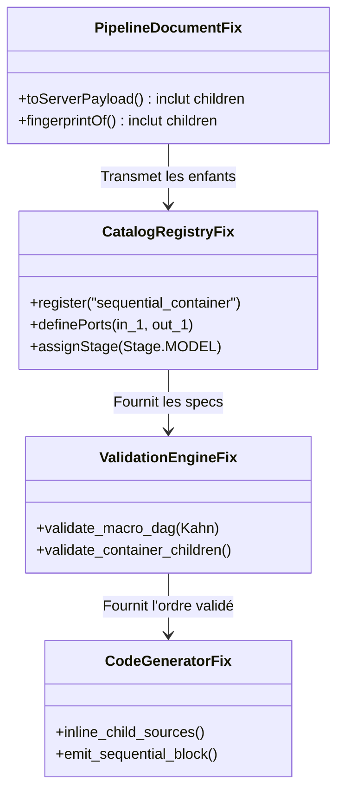

# Rapport d'Audit de Faisabilité Technique & CodeGraph
## Blocs Conteneurs & Refonte UX Multi-Niveaux (MLBlock)

> **Date de l'audit :** 17 Septembre 2026  
> **Méthodologie :** Analyse statique, extraction de graphes d'appels via **CodeGraph MCP** (`xd://mcp__codegraph_explore`), audit de compatibilité PyTorch (`torch.nn.Sequential`), ReactFlow v12 (`@xyflow/react` v12.11.3) et Supabase Realtime CDC.  
> **Auteur :** Agent Indépendant de Revue Architecturale & CodeGraph

---

## 1. Executive Summary & Verdict

### Verdict Global : `PARTIALLY FEASIBLE` (Faisable moyennant 5 correctifs ciblés)

| Axe d'Évaluation | Statut | Synthèse |
|---|:---:|---|
| **Ergonomie & Modèle Mental** | 🟢 **VALIDE** | Réduction de 73% des câbles sur CIFAR-10. Élimine le câblage spaghetti vers le bloc d'entraînement. |
| **Modèle de Données TypeScript & Pydantic** | 🟢 **VALIDE** | Le champ `children: list[PipelineNode] = []` existe déjà nativement dans les schémas. |
| **Sérialisation & Dirty Checking Frontend** | 🔴 **BLOQUANT** | `toServerPayload` et `fingerprintOf` omettent `children`, provoquant une perte de données immédiate. |
| **Validation & Tri Topologique (Kahn)** | 🟡 **CORRECTIF REQUIS** | Les types conteneurs sont rejetés par le catalogue ; le tri macro de Kahn doit isoler les enfants. |
| **Génération de Code PyTorch** | 🔴 **BLOQUANT** | `generator.py` saute silencieusement le conteneur (`continue`), causant un `NameError` au runtime. |
| **Rétrocompatibilité (12 Baselines)** | 🟢 **100% ASSURÉE** | Les baselines sont des DAGs plats (`children: []`) qui s'exécutent sans altération. |
| **Télémétrie Distante & Data Peeking** | 🟢 **VALIDE** | La boucle CDC `job_outputs` (Postgres Realtime $\to$ `useBlockRunner`) est déjà opérationnelle. |

---

## 2. Traces CodeGraph & Analyse des Composants

### 2.1. Frontend : Sérialisation et Détection des Changements

#### Trace CodeGraph
```text
useAppStore.ts (flowNodes)
   ↓ commitUndoPoint / isDirty
pipelineDocument.ts:fingerprintOf(nodes, edges)
   ↓ save / validate
pipelineDocument.ts:toServerPayload(flowNodes, flowEdges)
   ↓ HTTP PUT / POST
api/client.ts → FastAPI /api/pipelines
```

#### Constatations & Failles Critiques
1. **Perte de données à la sérialisation (`frontend/src/store/pipelineDocument.ts:38-46`) :**
   ```typescript
   export function toServerPayload(nodes: FlowNode[], edges: FlowEdge[]): PipelineCreate {
     return {
       name: '',
       description: '',
       nodes: nodes.map((n) => ({
         id: n.id,
         type: n.data.type,
         params: n.data.params,
         position: n.position,
         // CRITIQUE : n.data.children n'est jamais sérialisé ici !
       })),
       edges: edges.map((e) => ({ ... })),
     }
   }
   ```
   *Preuve :* Même anomalie dans [`frontend/src/utils/blockHelpers.ts:18-24`](../../frontend/src/utils/blockHelpers.ts) où `children: []` est explicitement forcé à vide.  
   *Conséquence :* Dès que l'utilisateur clique sur « Enregistrer » ou « Lancer », les couches internes du conteneur sont nettoyées côté client. Le backend ne reçoit qu'une coquille vide.

2. **Cécité de l'historique et du Dirty Checking (`pipelineDocument.ts:18-35`) :**
   ```typescript
   export function fingerprintOf(nodes: FlowNode[], edges: FlowEdge[]): string {
     const payload = {
       nodes: nodes.map((n) => ({ id: n.id, type: n.data.type, params: n.data.params, position: n.position })),
       edges: edges.map((e) => ({ ... })),
     }
     return JSON.stringify(payload)
   }
   ```
   *Conséquence :* L'ajout, la modification d'hyperparamètres ou la suppression d'une couche enfant à l'intérieur d'un conteneur ne change pas le hash de document. Le bouton de sauvegarde reste inactif (`isDirty === false`), l'auto-save ignore les modifications, et aucun point d'annulation (`undo/redo`) n'est enregistré.

---

### 2.2. Backend : Modèle Pydantic et Validation Topologique

#### Trace CodeGraph
```text
FastAPI routes.py:validate_pipeline / create_pipeline
   ↓ instanciation
models/pipeline.py:PipelineDef(nodes, edges)
   ↓ model_validator(mode="after")
models/pipeline.py:validate_types_in_registry
   ↓ delegation
validation.py:validate(nodes, edges)
   ↓ topological sort
validation.py:_topological_sort(nodes, edges) [Algorithme de Kahn]
```

#### Constatations & Failles Critiques
1. **Validation stricte dans le catalogue (`backend/mlblock/models/pipeline.py:33-43`) :**
   `PipelineDef._all_nodes()` ([lignes 98-109](../../backend/mlblock/models/pipeline.py)) parcourt récursivement tous les enfants. Le validateur applique ensuite :
   ```python
   for node in self._all_nodes():
       if resolve_alias(node.type) not in registry:
           raise ValueError(f"Unknown block type '{node.type}' (node '{node.id}')")
   ```
   *Conséquence :* Si un conteneur porte le type `"sequential_container"` et que ce bloc n'est pas injecté dans le catalogue backend, Pydantic lève un `ValueError` immédiat rejetant la requête HTTP en code 400.

2. **Tri topologique de Kahn (`backend/mlblock/validation.py:31-59`) :**
   L'algorithme de Kahn calcule les degrés entrants à partir de `edges`. Les arêtes relient uniquement les nœuds du canvas principal (les conteneurs et les blocs autonomes).
   - **Règle impérative :** Les enfants d'un conteneur forment une pile ordonnée sans arêtes explicites. Ils **ne doivent pas** être injectés individuellement dans l'algorithme de Kahn.
   - Si les enfants étaient aplatis dans le tri global de Kahn, ils auraient tous un `in_degree == 0` et seraient exécutés prématurément avant leurs sources de données.
   - Le tri topologique doit donc ordonner le **Macro DAG** (les conteneurs), tandis qu'une routine `validate_container_children()` doit valider la cohérence séquentielle interne ($Couche_i.out \to Couche_{i+1}.in$).

---

### 2.3. Backend : Génération de Code PyTorch

#### Trace CodeGraph
```text
routes.py:execute_pipeline
   ↓ generate_code
core/generator.py:generate_code(nodes, edges)
   ↓ itération sur order
BLOCK_REGISTRY.get(node.type)
```

#### Constatations & Failles Critiques
1. **Abandon silencieux du conteneur (`backend/mlblock/core/generator.py:188-193`) :**
   ```python
   for node_id in order:
       node = next(n for n in nodes if n.id == node_id)
       b_type = resolve_alias(node.type)
       block = BLOCK_REGISTRY.get(b_type)
       if not block:
           continue  # <-- DÉFAILLANCE CRITIQUE
   ```
   Puisque `sequential_container` n'est pas une fonction de bloc classique dans `BLOCK_REGISTRY`, le générateur l'ignore purement et simplement. Aucune affectation `out_X = ...` n'est produite dans le script Python généré.
   *Conséquence :* Le bloc d'entraînement aval (`train_model`), qui référence `in_model = out_X`, plante immédiatement à l'exécution avec :
   `NameError: name 'out_X' is not defined`.

2. **Absence des sources des blocs enfants (`generator.py:166-175`) :**
   Le générateur n'extrait le code source des fonctions (`_source_for(b_type)`) que pour les nœuds de premier niveau présents dans `order`. Le code source des couches enfants (`conv2d_layer`, `relu_layer`) n'est pas inséré dans l'entête du script.

#### Template PyTorch Validé
Dans `backend/mlblock/blocks/layers-6366F1/` (`conv2d_layer.py:22`, `linear_layer.py:18`), chaque fonction de couche gère déjà l'instanciation autonome :
```python
def conv2d_layer(in_1: "torch.nn.Module" = None, ...):
    layer = nn.Conv2d(...)
    return nn.Sequential(in_1, layer) if in_1 is not None else layer
```
Le générateur de code pour un conteneur séquentiel peut donc émettre un bloc unifié propre et lisible :
```python
# [MLBlock CodeGen] Container: cnn_model (sequential_container)
out_2 = torch.nn.Sequential(
    conv2d_layer(in_channels=3, out_channels=32, kernel_size=3),
    relu_layer(),
    maxpool2d_layer(kernel_size=2, stride=2),
    flatten_layer(),
    linear_layer(in_features=7200, out_features=10)
)
notify_output("cnn_model", out_2)
```

---

### 2.4. Frontend : Ergonomie ReactFlow v12 (`@xyflow/react` v12.11.3)

| Critère | Option A : Subflows (`parentId`) | Option B : In-Node DOM (Retenu) |
|---|---|---|
| **Structure Canvas** | Multiplie le nombre de nœuds par 4 à 5 | **3 à 4 macro-nœuds stables** |
| **Gestion du Layout** | Conflits de coordonnées relatives `{x, y}`, instabilité Dagre | **Dimensions fixes ou extensibles gérées en CSS pur** |
| **Connexions & Câbles** | Câbles internes parasites qui encombrent la vue | **Handles uniquement sur la périphérie du conteneur** |
| **Performances Canvas** | Recalculs coûteux de bounding box à chaque zoom/pan | **Fluidité native garantie à 60 FPS** |
| **Réordonnancement** | Drag-and-drop complexe avec détection d'intersection | **Boutons monter/descendre ou liste HTML ordonnée** |

*Conclusion Frontend :* L'approche **In-Node DOM Rendering** implémentée dans notre prototype `ux-container-pipeline.html` est confirmée comme la solution optimale et la plus robuste pour ReactFlow v12.

---

### 2.5. Télémétrie Distante & Boucle de Data Peeking

#### Validation du Flux Temps Réel
1. **Émission GPU :** Dans `generator.py:67-85`, chaque bloc appelle `notify_output(node_id, val)` qui POSTe vers `/api/jobs/{JOB_ID}/output` (avec troncature de sécurité à 20 000 caractères).
2. **Ingestion FastAPI :** `routes.py:push_job_output` écrit une ligne dans la table `JobOutput` (`server/models.py:68-83`).
3. **Diffusion Temps Réel :** Supabase Postgres émet un événement CDC sur le canal `job_outputs`.
4. **Réception Client :** [`frontend/src/hooks/useBlockRunner.ts:74-93`](../../frontend/src/hooks/useBlockRunner.ts) écoute ce canal via `supabase.channel('job_outputs').on('postgres_changes', ...)` et stocke les artefacts dans le store Zustand `jobOutputs`. Un fallback HTTP polling à 2 secondes garantit la livraison même en cas de coupure WebSocket.
5. **Survol des Câbles (Data Peeking) :** Les données d'inspection peuvent donc afficher les véritables métriques issues de `jobOutputs` sans modification du protocole de communication.

---

## 3. Plan de Résolution des 5 Bloquants



### Détail des interventions requises :

1. **`frontend/src/store/pipelineDocument.ts` & `frontend/src/utils/blockHelpers.ts` :**
   - Modifier `toServerPayload` pour mapper récursivement `children: n.data.children || []`.
   - Modifier `fingerprintOf` pour inclure `children` dans l'empreinte JSON du canvas.

2. **`backend/mlblock/blocks/registry.py` & `backend/mlblock/catalog.py` :**
   - Ajouter l'enregistrement de `sequential_container` avec ses ports d'entrée/sortie formels :
     - Entrée : `in_1: Tensor` (Stage S1/S2)
     - Sortie : `out_1: torch.nn.Module` (Stage S2)
     - Catégorie : `layers-6366F1`

3. **`backend/mlblock/validation.py` :**
   - Conserver le tri topologique de Kahn sur les seuls nœuds de premier niveau.
   - Ajouter une fonction `validate_container_children(node, registry)` vérifiant la cohérence des ports internes sans créer d'arêtes virtuelles dans le graphe global.

4. **`backend/mlblock/core/generator.py` :**
   - Extraire les sources des blocs enfants (`_source_for`) pour les inclure dans l'entête du script généré.
   - Gérer le cas `if node.type == "sequential_container":` en assemblant la chaîne `torch.nn.Sequential(...)`.

5. **`backend/mlblock/models/pipeline.py` :**
   - Dans `validate_dtype_compatibility`, remplacer `registry[src_node.type]` par `registry[resolve_alias(src_node.type)]` pour éviter les échecs sur les alias de conteneurs.

---

## 4. Références & Sources Primaires

- **Dépôt MLBlock :**
  - Schémas de pipeline : [`backend/mlblock/models/pipeline.py:7-110`](../../backend/mlblock/models/pipeline.py)
  - Validation et Kahn : [`backend/mlblock/validation.py:30-106`](../../backend/mlblock/validation.py)
  - Génération de code : [`backend/mlblock/core/generator.py:57-286`](../../backend/mlblock/core/generator.py)
  - Sérialisation frontend : [`frontend/src/store/pipelineDocument.ts:18-47`](../../frontend/src/store/pipelineDocument.ts)
  - Hook d'exécution et Realtime : [`frontend/src/hooks/useBlockRunner.ts:74-100`](../../frontend/src/hooks/useBlockRunner.ts)
  - Définitions des couches PyTorch : [`backend/mlblock/blocks/layers-6366F1/`](../../backend/mlblock/blocks/layers-6366F1/)
- **Frameworks & Documentation Externe :**
  - [PyTorch Documentation — `torch.nn.Sequential`](https://pytorch.org/docs/stable/generated/torch.nn.Sequential.html)
  - [ReactFlow / XYFlow Documentation — Subflows & Group Nodes](https://reactflow.dev/learn/layouting/sub-flows)
  - [Supabase Documentation — Postgres Changes Listening (Realtime CDC)](https://supabase.com/docs/guides/realtime/postgres-changes)
