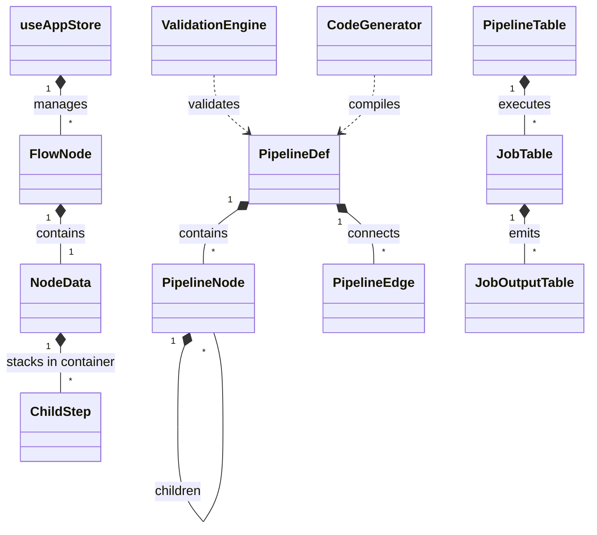

# Refonte UX MLBlock — Blocs Conteneurs, Multi-Entrées & Flux Vivant

> **Document de cadrage et synthèse de la refonte d'expérience utilisateur (UX/UI)**  
> *Prototype interactif de référence :* [`ux-container-pipeline.html`](./ux-container-pipeline.html)

---

## 1. Contexte & Problématique

Dans l'état actuel de MLBlock, l'assemblage d'un modèle d'apprentissage profond canonique (comme le tutoriel PyTorch **CIFAR-10 60min Blitz - Baseline A1**) souffre d'un défaut d'utilisabilité majeur : **la granularité de micro-code imposée sur un canvas 2D**.

### Symptômes observés
1. **L'illusion du graphe 2D pour une pile 1D :** Pour construire un réseau séquentiel de 4 couches, l'utilisateur doit poser 6 à 8 boîtes individuelles (`Conv2D` $\to$ `ReLU` $\to$ `MaxPool2D` $\to$ `Conv2D` $\to$ `Flatten` $\to$ `Linear`) et tirer 7 câbles identiques au millimètre.
2. **La convergence spaghetti vers le Trainer :** Le bloc `train_model` accumule jusqu'à 4 entrées anonymes (`in_1`, `in_2`, `in_3`, `in_4`). Une erreur de branchement entre l'optimiseur et les données provoque un échec d'exécution immédiat.
3. **Temps de mise en œuvre disproportionné :** 35 à 50 minutes d'assemblage fastidieux pour reproduire ce qui s'écrit en 4 lignes de code PyTorch.

---

## 2. Piliers de la Solution Validée

### A. Le principe de la « Poupée Russe » (LOD - Level of Detail)
- **Niveau 1 (Macro - Canvas) :** Le canvas principal reste une autoroute linéaire de **3 à 4 Super-Blocs** (Données $\to$ Modèle $\to$ Entraîneur $\to$ Évaluateur).
- **Niveau 2 (Micro - In-Block) :** Les composants atomiques d'un même domaine sont regroupés à l'intérieur du conteneur (les couches séquentielles dans le modèle, les transformations dans le bloc données, les callbacks dans l'entraîneur).

### B. Typage à deux niveaux
- **Typage Macro :** Contrôle des contrats d'interface par `Stage` (S0..S4) et `DType` via `TypeSystem.classify()`.
- **Inférence Micro (Analytique) :** Calcul arithmétique pur des dimensions de tenseurs ($O = \frac{W - K + 2P}{S} + 1$) dans le conteneur pour auto-compléter les `in_features` sans exécution distante.

### C. Flux Vivant & Data Peeking compatible Remote
- **Couleurs sémantiques :** Violet (Données / Tenseurs), Orange (Modèle / Poids), Vert (Métriques), Bleu (Hyperparamètres / Optimiseur).
- **Aperçu contextuel (Peeking) :** Métadonnées statiques en conception, et données réelles (miniatures, courbes, matrices) issues de Supabase DB & Realtime après exécution sur GPU distant.

---

## 3. Comparatif d'Efficacité (Baseline A1 CIFAR-10)

| Critère | Architecture Actuelle (11 Blocs) | Nouvelle UX Cible (3 Super-Blocs) | Gain |
|---|:---:|:---:|:---:|
| **Nombre de blocs sur le canvas** | 11 blocs éparpillés | 3 blocs alignés | **-73% d'encombrement** |
| **Nombre de câbles à tirer** | 11 câbles | 3 câbles typés | **-73% de câblage** |
| **Risque d'inversion des entrées** | Élevé (`in_1..in_4` anonymes) | Nul (slots colorés & étiquetés) | **Zéro confusion** |
| **Temps d'assemblage utilisateur** | 35 à 50 minutes | **Moins de 2 minutes** | **x20 de rapidité** |

---

## 4. Index des Spécifications Techniques

Les détails techniques complets sont documentés dans les fichiers suivants :

- 📐 [**ARCHITECTURE.md**](./ARCHITECTURE.md) : Modèles de données, typage macro/micro, schéma de stockage et **diagramme de classes Mermaid**.
- 🔄 [**DATA_FLOW_SEQUENCE.md**](./DATA_FLOW_SEQUENCE.md) : Cycle de vie distant, persistance Supabase, exécution Vast.ai et **diagramme de séquence Mermaid**.
- 🎨 [**UI_SPECIFICATION.md**](./UI_SPECIFICATION.md) : Spécifications des composants d'interface, slots multi-entrées, tiroir d'étapes et moteur Pan & Zoom réactif.
