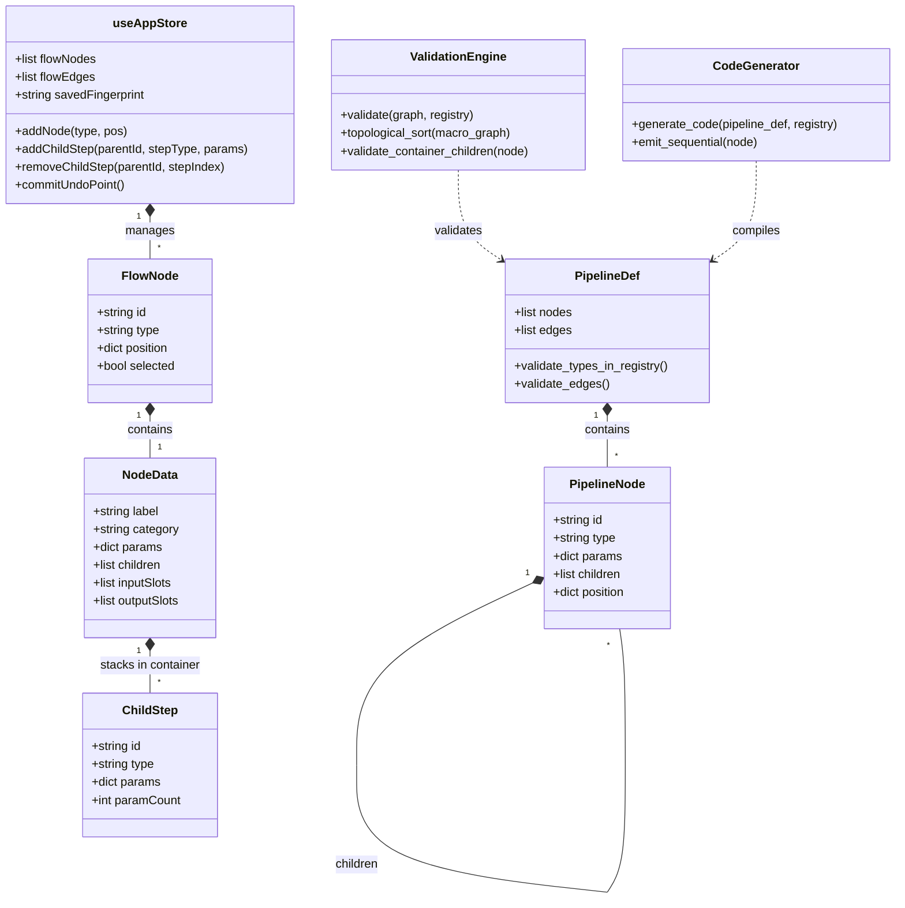
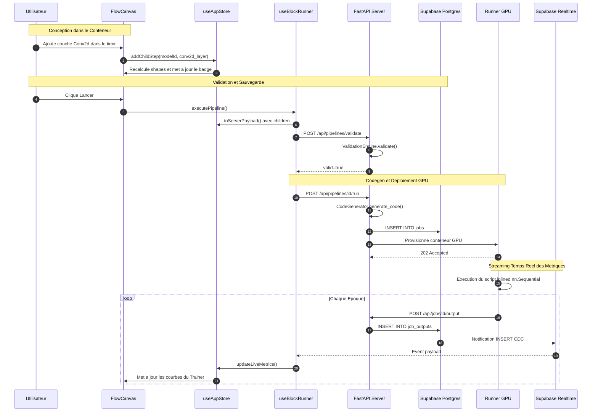

# Architecture Diagrams — Super-Blocks & Containers

This companion document holds the structural, sequence, and flow diagrams for `SPEC-super-blocks`.

---

## 1. Macro vs Micro Pipeline Data Flow

```text
CANVAS PRINCIPAL (Macro — Graphe de Flux 2D)
  [ DataPipeline ]  ════( DataLoader )════►  [ DeepTrainer ]  ────( metrics )────►  [ Visualizer ]
                                                  ▲
  [ SequentialModel ]  ══( nn.Module )════════════╝
         │
         ▼
TIROIR INTERNE (Micro — Recette Séquentielle 1D)
  ┌────────────────────────────────────────────────────────┐
  │  1. Conv2d (in=3, out=32, k=3)   ──► out: [32, 30, 30] │
  │  2. ReLU()                       ──► out: [32, 30, 30] │
  │  3. MaxPool2d (k=2, s=2)         ──► out: [32, 15, 15] │
  │  4. Flatten()                    ──► out: [7200]       │
  │  5. Linear (in=7200, out=10)     ──► out: [10]         │
  └────────────────────────────────────────────────────────┘
```

---

## 2. Structural Class Diagram (Mermaid)



---

## 3. Execution & Telemetry Sequence Diagram


